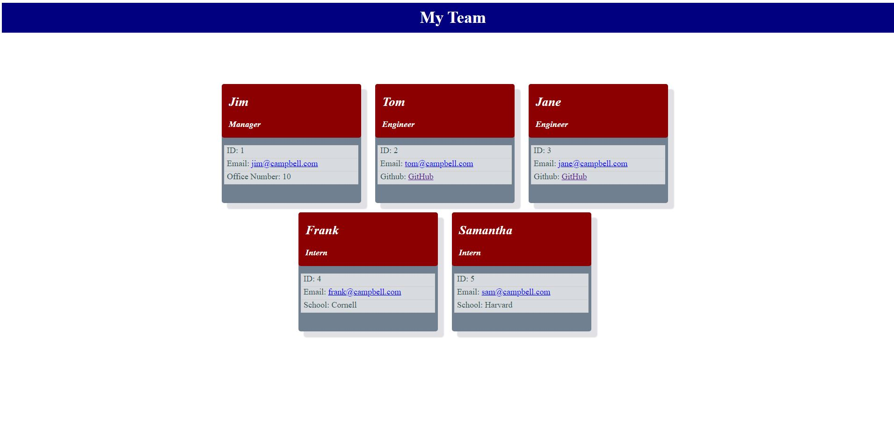

# campbell-team-profile
 - Created a base class for all employees with shared variables (e.g. name, email)
 - Created classes for specific employees as extensions of the base Employee class
 - Drafted tests using Jest for each of the classes & set thresholds for passing
 - Implemented prompts using Inquirer to gather data from the user
 - Added functionality to add additional employees, in perpetuity, using a nested callback loop
 - Developed a website layout, including header & blocks for each employee with associated data
 - Added functionality to auto-generate the html based on an array of data provided by the end user

Deployed application can be found at: https://campbefs.github.io/campbell-team-profile/

